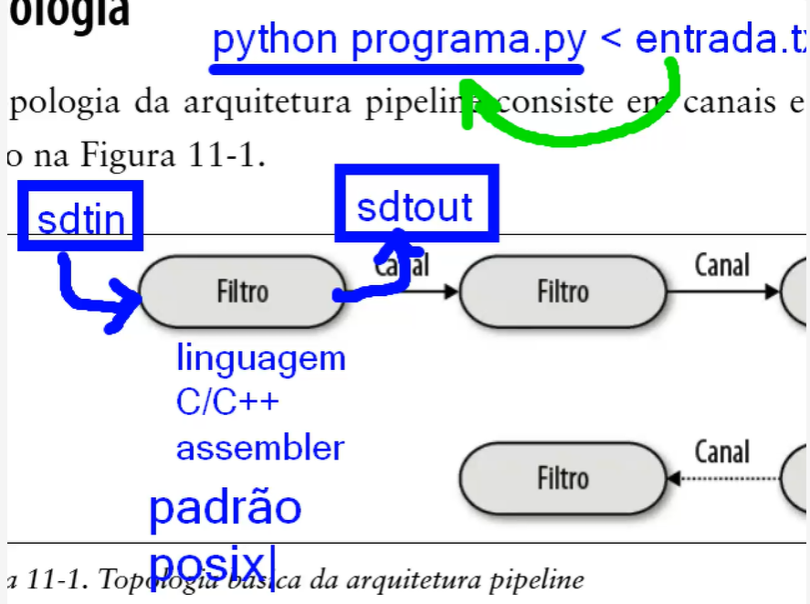
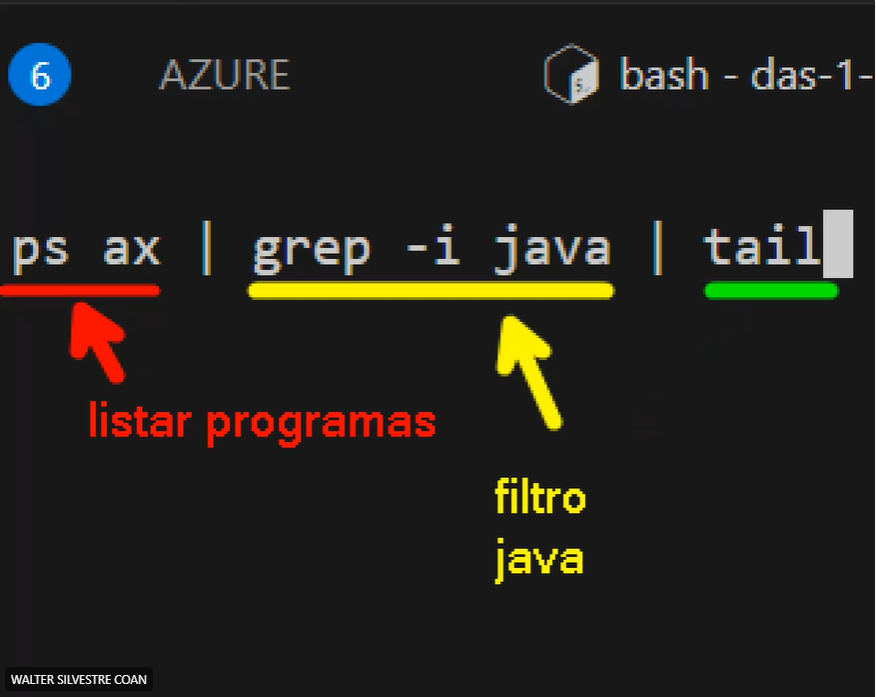

# Aula 31/07

## Abstrações

Transformar problemas reais em soluções técnicas

## Api

Abstraía as funcionalidades do back-end

## Complexidade

Assim como na vida real a complexidade faz parte do desenvolvimento de software, antes algo que podia ser resolvido com um código simples, hoje, deve ser orientado e divido em classes, porém é passando pela complexidades que podemos evoluir profissionalmente.

## Framework

Facilita o desenvolvimento do programa, quebrando problemas de comunicação complexos em simples códigos ou até mesmo linhas. A escolha de um framework é extremamente importante para a criação de um sistema.

Para estudos, é importante aprender ao menos 1 framework, pois a maioria é muito semelhante e ao dominar 1 é muito fácil de se aprender outro.

## Estrutura de Dados

Característica muito valorizada por grandes empresas, a escolha da estrutura correta e aplicação da mesma é o que permite sistemas complexos de funcionarem corretamente.

## Information Hiding

Oculta a complexidade e a transforma em coisas simples para o dia-a-dia, ou seja, não precisamos saber o que acontece por detrás dos panos para entender como é o funcionamento do produto.

# Aula 04/08

## Getter e Setter

São utilizados para encapsular as informações e protege-las

## Coesão

Toda classe deve implementar uma única responsabilidade, ou seja, ser responsável por fazer uma única função, bem feita. A coesão facilita a implementação de uma classe, seu entendimento e também sua manutanção, facilita a alocação de um único responsável e o reúso e teste de uma classe.

## Acoplamento

Quando falamos de acoplamento nos referimos a conexão entre duas classes, no qual existem 2 tipos: acomplamento aceitável e acoplamento ruim.

A seta entre A e B indíca uma variável

Class A {
    private B b;
    public A(){
        b = new B();
        b.fazqq();
    }
}

Sempre que possível o ideal é reduzir o acoplamento, podendo através de certos métodos criar iterfaces "portas usbs" permitindo que ao trocar um código conectado a esta interface, o sistema não quebre.

"Maximize a coesão das classes e minimize o acoplamento entre elas."

# Aula 07/08  

## SOLID

## Princípio da Responsabilidade Única (SRP)

- Esse princípio está ligado diretamente à ideia de coesão.

- Cada classe deve assumir apenas uma responsabilidade, ou seja, ter um único motivo para ser alterada.

- Isso significa separar o que é apresentação (exibição de dados, interface) do que é regra de negócio (lógica e processamento).

- Classes que lidam com a parte visual não devem depender das que tratam da lógica, já que cada uma evolui por razões diferentes.

- Um exemplo de quebra desse princípio seria criar uma classe que, além de calcular valores, também imprime os resultados no console.

## Princípio da Segregação de Interfaces (ISP)

- O foco aqui são as interfaces: elas precisam ser pequenas, coesas e específicas.

- Esse princípio é uma extensão da responsabilidade única, mas aplicado às interfaces.

- O objetivo é garantir que os clientes (classes que usam essas interfaces) não precisem implementar métodos que não fazem sentido para eles.

- Quando uma interface reúne funcionalidades de grupos diferentes, o ideal é dividi-la em várias interfaces menores e direcionadas.

- Isso reduz dependências desnecessárias e aumenta a flexibilidade do sistema.

## Padrões de Projeto

- São 22 soluções recorrentes para problemas comuns de design de software.

- Padrão Observador (Observer)

- Exemplo clássico: a interface listener (como um “click listener”).

- Caso seja necessário reagir a outro tipo de evento (ex.: movimento), cria-se uma interface dedicada para isso.

# Aula 11/08

## Princípio de Inversão de Dependências

Esse princípio recomenda que uma classe cliente deve estabelecer dependências pioritariamente com abstrações e com implementações concretas

Os controladores precisam de uma dependência, no caso, interfaces de serviço e não com a implementação concreta, ou seja, service impl

O cliente não "conversa" diretamente com o código, ele aguarda em uma interface pela resposta do código

## Prefira Composição a Herança

Existem dois tipos de herança:

Herança de classes: envolve reúso de código (deve ser evitada).

Herança de interfaces: Permite que uma interface herde de outras interfaces, estabelecendo um conjunto de métodos que devem ser implementados por classes que implementam a interface derivada

Ao invés de se utilizar heranças o ideal é se utilizar associações, heranças tendem a introduzir problemas na manutenão e evolução de classes de um sistema.

Heranças só podem ser utilizada se as subclasses nunca irão se juntar, exemplo um "gato" não pode ser um "cachorro" portanto pode se utilizar heranças.

## Princípio de Demeter ou Menor Conhecimento

Um método deve invocar somentes os seguintes outros métodos:

1- de sua própria classe
2- de objetos passados como parâmetros
3- de objetos criados pelo próprio métodos
4- de atributos da classe do método

## Princípio Aberto/Fechado

-Uma classe deve estar fechada para modificações e aberta para extensões.  
-*Classe Abstrata*: pegar uma classe e misturar com uma interface (meio incompleta).  
-Isso significa projetá-la de forma a permitir novas funcionalidades sem alterar seu código, usando recursos como herança, funções lambda e padrões de projeto, garantindo flexibilidade e adaptabilidade. 

# Aula 14/08  

## Princípio de Substituição de Liskov (LSP)

-Herança define uma relação *é-um* entre objetos de uma classe base e objetos de subclasses.  
-Quando se tem uma herança, subclasses precisam dos mesmos métodos que o pai.
-Substitui um filho por outro, sem ter perda.

# Aula 18/08

## Padrões de Projeto

# Aula 28/08

A estrutura escolhida serve para suportar o que for colocado no código

"Arquitetura é sobre algo importante… seja lá o que for." — Ralph Johnson

Características de Arquitetura como Requisitos Não Funcionais

As características arquiteturais representam os critérios essenciais para o sucesso de um sistema, geralmente relacionados a aspectos não funcionais, como desempenho, segurança e escalabilidade, que são independentes das funcionalidades específicas. Nem sempre é possível atender a todas essas características simultaneamente, sendo necessário priorizar algumas em detrimento de outras, conforme as necessidades do projeto.

Decisões de Arquitetura

O arquiteto de software deve escolher tecnologias e abordagens com as quais tenha maior domínio e que melhor atendam aos objetivos do sistema. Essas decisões estabelecem diretrizes claras sobre como o sistema deve ser desenvolvido, garantindo consistência e qualidade na implementação.

Princípios de Design

Entre os princípios fundamentais, destaca-se a minimização do acoplamento entre componentes para aumentar a modularidade e facilitar a manutenção. Em arquiteturas baseadas em microserviços, recomenda-se o uso de comunicação assíncrona via mensagens para melhorar o desempenho e a escalabilidade dos serviços.

# Aula 01/09

## Expectativas de um Arquiteto

Existem 8 expectativas principais para um arquiteto de software

## Orientação é a palavra de ordem nessa primeira expectativa

1- Tomar decisões de arquitetura
2- Analisar continuamente a arquitetura
3- Manter-se atualizado com as últimas tendências
## levando em consideração a relevância para seu contexto
4- Assegurar a conformidade com as decisões
## servir como um guia para a equipe, levando em consideração o contexto do projeto
5- Exposição e experiência diversificadas
## Carreira profissional relevante
6- Ter conhecimento sobre o domínio do negócio
7- Ter habilidades interpessoais
8- Entender e lidar bem com questões políticas

DevOps - Considerado um clico contínuo e interno

Entregar valor para o cliente

1- Planejar
2- Criar - Codar
3- Publicar o código em um lugar central - Integração contínua
4- Implantar - Cliente final
5- Operar - Monitorar
6- Comentários contínuos

# Aula 04/09

## Diferença entre arquitetura e Design 

Enquanto o arquiteto é responsável pela parte estrutural do desenvolvimento de software, o designer foca na parte visual e de usabilidade, como criar telas, fluxos de navegação e diagramas de classes. O arquiteto atua analisando os requisitos do sistema, definindo padrões de arquitetura, escolhendo tecnologias e garantindo que a solução seja escalável, segura e mantenha qualidade técnica ao longo do tempo.

O designer se preocupa em tornar a experiência do usuário intuitiva e agradável, trabalhando com aspectos estéticos e interação. Já o arquiteto precisa pensar em como os componentes do sistema se conectam e funcionam juntos, antecipando possíveis problemas e facilitando a comunicação técnica entre as equipes. Assim, apesar de ambos colaborarem para o sucesso do projeto, seus focos e responsabilidades são complementares, mas distintos.

## Arquitetura

As decisões que o arquiteto toma nem sempre funcionam para as equipes de desenvolvimento, e as mudanças feitas pelas equipes, que impactam a arquitetura, raramente são comunicadas de volta ao arquiteto. Para que a arquitetura funcione bem, é necessário quebrar as barreiras físicas e virtuais entre arquitetos e desenvolvedores, criando uma relação bidirecional forte entre ambos.

## Escopo dos Detalhes Técnicos

O nível de detalhes técnicos varia entre desenvolvedores e arquitetos. Diferente do desenvolvedor, que precisa de profundidade técnica para executar seu trabalho, o arquiteto deve ter uma grande amplitude técnica para pensar estrategicamente e enxergar as questões sob a perspectiva da arquitetura.

## Valor do Arquiteto

Grande parte do valor do arquiteto está no seu amplo conhecimento tecnológico e na capacidade de usar essas tecnologias para resolver problemas específicos. Por exemplo, é mais vantajoso para um arquiteto conhecer cinco soluções diferentes para um problema do que ser especialista em apenas uma.

## Amplitude vs Profundidade

Para arquitetos, a amplitude é mais importante do que a profundidade técnica. Eles devem tomar decisões que combinam capacidades com restrições técnicas, por isso, possuir um vasto conhecimento de diversas soluções é fundamental.

## Como é a formação do conhecimento de um arquiteto modelo T?

Um arquiteto modelo T tem conhecimento amplo de várias tecnologias e domínio profundo em pelo menos uma área técnica. Ele entende diferentes soluções, sabe fazer escolhas estratégicas e técnicas. Esse conhecimento se forma ao aprender continuamente, explorar novas tecnologias e se envolver em decisões práticas, como provas de conceito e revisão de código. É importante equilibrar visão técnica com entendimento dos objetivos do negócio. Assim, o arquiteto T atua como um elo entre times e tecnologias, garantindo qualidade e inovação.

# Aula 06/10

## Resumo Reduzido do Capítulo 4 – Características da Arquitetura

O capítulo 4 trata das características da arquitetura, que diferem dos requisitos funcionais por não definirem o que o sistema faz, mas sim como ele deve operar para ser eficiente, confiável e sustentável. Essas características são críticas porque orientam decisões estruturais de design e garantem o sucesso do software.

Para serem consideradas características da arquitetura, elas devem: representar uma consideração de design fora do domínio do problema, influenciar a estrutura do sistema e ser essenciais para o sucesso da aplicação. Algumas são explícitas, aparecendo nos requisitos, e outras implícitas, como segurança e disponibilidade, que muitas vezes não são documentadas, mas são indispensáveis.

O texto organiza essas características em três grupos principais:

- Operacionais, que lidam com o funcionamento em produção. O quadro destacado no capítulo lista as mais importantes: disponibilidade, continuidade, desempenho, recuperabilidade, 

- confiabilidade/segurança, robustez e escalabilidade. Elas asseguram que o sistema seja estável, resiliente e capaz de crescer.
"0
- Estruturais, que envolvem a qualidade interna do código, como modularidade, manutenção, portabilidade e atualização.

- Transversais, que abrangem questões gerais, como acessibilidade, requisitos legais, segurança, privacidade e usabilidade.

Outro ponto relevante discutido é a constante ambiguidade que cerca esses termos. Muitos deles, como disponibilidade e confiabilidade, se sobrepõem, e a falta de padronização pode gerar confusão entre equipes e organizações. O capítulo lembra que, por essa razão, arquitetos muitas vezes criam suas próprias nomenclaturas ou definições internas para lidar com as necessidades específicas de seus contextos.

Também se destaca a questão dos trade-offs, já que não é possível maximizar todas as características da arquitetura ao mesmo tempo. Melhorar a segurança, por exemplo, quase sempre implica perda de desempenho. Por isso, o papel do arquiteto é equilibrar essas escolhas, priorizando as características mais críticas para o negócio. O texto utiliza a metáfora de pilotar um helicóptero, em que cada ajuste em um controle afeta os outros, para ilustrar esse equilíbrio delicado.

O capítulo conclui enfatizando que não se deve buscar a “melhor arquitetura”, mas sim a “menos pior”, aquela que consegue atender às necessidades mais importantes sem sobrecarregar o sistema com exigências excessivas e contraditórias. Nesse sentido, a arquitetura deve ser pensada de forma iterativa, permitindo ajustes contínuos conforme as necessidades do projeto e do negócio evoluem. Essa abordagem reflete diretamente os princípios do desenvolvimento ágil, que valorizam a adaptação e a evolução incremental.

## Aula 13/10

- **CQRS**

- Look contention: dpois usuários usando um serviço, ee trava a operação
- Performace problems: problemas de limitações, sistema operacional não suporta

- spring comentar en dois tipos de dados 1-write 2-read
  - Acaba com o dead lock
  - segrega para uma instancia
  - SEPARAÇÃO DE RESPOSABILIDADE

### Padrões Fundamentais

- Estilos de Arquitetura

- A grabde bola de lama: onde o código é uma confusão mal estruturada
- sistema que cresceu de forma totalmete desordenada

- Arquitetura Unitária: 

- Cliente/ Servido

- Desktop + Servidor de banco de dados

- Navegador + Servidor web

<<<<<<< HEAD
## Aula 16/10

### Retry pattern
  Ele permite que uma aplicação trate falhas transitórias ao tentar se
  conectar a um serviço ou recurso de rede, repetindo de forma transparente uma operação que falhou.

- **Estratégias de Repetição:**
  - Cancelar: Se a falha indicar que não é transitória ou é improvável que seja bem-sucedida se repetida, a aplicação deve cancelar a operação e relatar uma exceção.

  - Tentar novamente imediatamente: Se a falha for incomum ou rara, como um pacote de rede corrompido durante a transmissão, o melhor curso de ação pode ser repetir imediatamente a solicitação.

  - Tentar novamente após atraso: Se a falha for causada por falhas mais comuns de conectividade ou serviço ocupado, a rede ou o serviço pode precisar de um curto período enquanto os problemas são corrigidos. Nesse caso, atrasar programaticamente a repetição é uma boa estratégia.

- Evitar tempestades de repetição
- Registrar falhas
- Testar o código de repetição

### Fundamentos: 

- **Arquiteturas Monolíticas Versus Distribuídas**
    - monolítico (uma unidade de implementação de todo o código)
    - distribuído (várias unidades de implementação conectadas por protocolos de acesso remoto)
    - Arquiteturas distribuídas oferecem melhor desempenho, escalabilidade e disponibilidade, mas trazem maior complexidade e riscos, principalmente por dependerem da rede. Esses riscos são resumidos nas oito falácias da computação distribuída

- **As 8 Falácias da Computação Distribuída**

- A Rede é Confiável:
  A rede pode falhar. Serviços podem ficar inacessíveis, exigindo uso de timeouts e circuit breakers.

- A Latência é Zero:
  Chamadas remotas são muito mais lentas que chamadas locais. É crucial medir e conhecer a latência média e seus percentis.

- A Largura de Banda é Infinita:
  A comunicação entre serviços consome banda. O excesso de dados transmitidos (stamp coupling) prejudica o desempenho.

- A Rede é Segura:
 Cada endpoint deve ser protegido, aumentando a complexidade e reduzindo o desempenho.

- A Topologia Nunca Muda:
  A infraestrutura de rede muda constantemente, afetando latência e conexões. É vital manter comunicação com a equipe de rede.

- Existe Apenas um Administrador:
  Há vários administradores e equipes de rede; a coordenação entre todos é necessária.

- O Custo do Transporte é Zero:
  Chamadas remotas têm custos reais (infraestrutura, servidores, gateways, proxies etc.), tornando sistemas distribuídos mais caros.

- A Rede é Homogênea:
  Redes usam equipamentos de múltiplos fornecedores, nem sempre totalmente compatíveis, afetando desempenho e confiabilidade.

## Aula 20/10 e 23/10

### Estilo de Arquitetura em Camadas

  Os componentes no estilo de arquitetura em camadas são organizados em camadas horizontais lógicas, com cada camada tendo uma função específica dentro da aplicação (como lógica de apresentação ou lógica de negócio).

- **Camadas de Isolamento**
  - Significa que as alterações feitas em uma camada da arquitetura normalmente não impactam nem afetam os componentes nas outras camadas, fazendo com que os contratos entre essas camadas continuem inalterados.
  - Cada camada no estilo de arquitetura em camadas pode ser fechada ou aberta
  - Fechada: conforme uma requisição desce de camada em camada, ela não pode pular nenhuma, mas pode passar pela camada imediatamente abaixo dela para chegar na próxima
  - Aberta: camada de apresentação acessasse o banco de dados diretamente para as solicitações de recuperação simples, evitando as camadas desnecessárias

- **Adicionando Camadas**
  - Adicionar camadas abertas e fechadas ajuda a controlar o acesso entre partes da arquitetura.
  - Quando há objetos compartilhados (como utilitários ou logs) que não devem ser acessados por certas camadas, cria-se uma nova camada de serviços para isolá-los.
  - Essa camada é aberta para permitir flexibilidade, enquanto outras permanecem fechadas para manter o isolamento.
  - Documentar quais camadas são abertas ou fechadas evita acoplamento excessivo e facilita manutenção e testes.

- **Classificações das Características da Arquitetura**
  A arquitetura em camadas é simples, de baixo custo e fácil de entender, mas tem limitações importantes à medida que cresce em tamanho e complexidade

- Pontos fortes:

★★★★★ Custo e simplicidade: fáceis de implementar e manter, por serem monolíticas e sem dependência de rede.

- Pontos fracos:

★★ Implementabilidade e testabilidade: mudanças pequenas exigem nova implementação completa, com alto risco e pouco suporte a testes abrangentes.

★★★ Confiabilidade: razoável pela ausência de falhas de rede, mas afetada pela baixa testabilidade e risco de falhas globais.

★ Elasticidade e escalabilidade: muito limitadas; difícil aumentar capacidade ou desempenho sem grande esforço técnico.

★★ Desempenho: prejudicado por camadas fechadas e falta de paralelismo; pode ser melhorado com cache e multithreading, mas não é natural ao modelo.

★ Tolerância a falhas e disponibilidade: frágeis; um erro pequeno pode derrubar toda a aplicação e o tempo de recuperação é alto.

# Aula 27/10

## Arquitetura de Pipeline

A arquitetura pipeline (ou pipes-and-filters) é um estilo fundamental que divide a funcionalidade em partes independentes conectadas em sequência. É o princípio por trás de linguagens como Bash e Zsh, e tem paralelos em linguagens funcionais e no modelo MapReduce. Embora apareça em exemplos simples, também se aplica a sistemas comerciais complexos.

Os filtros são divididos em categorias sendo elas:

*Produtor* - ponto de partida

*Transformador* - aceita a entrada e se necessário realiza uma transformação

*Verificador* - Aceita a entrada, testa um ou mais critério e se necessário produz uma saída

*Consumidor* - O Ponto de término do fluxo da pipeline

